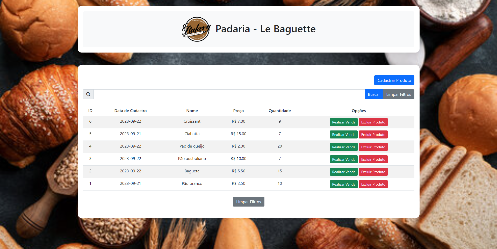

# Projeto Front-end: Gerenciamento de Produtos - Padaria Le Baguette

Este projeto é um sistema de gerenciamento de produtos para uma padaria fictícia chamada "Le Baguette". Ele permite ao usuário cadastrar, listar e vender produtos, além de filtrar a lista de produtos cadastrados. Ela foi construída para consumir a [Padaria API](https://github.com/vitaledu/MVP_backend_bakery), também construída por mim.

## 🚀 Instalação e Configuração

1. Como primeiro passo, siga todas as orientações para rodar o backend que este frontend irá consumir:
   ```sh
   # Clone o diretório do backend e siga suas orientações 
   git clone <https://github.com/vitaledu/MVP_backend_bakery.git>
   
   ```

2. Após o backend indicado estar rodando e funcionando, Clone este repositório:
   ```sh
   git clone <https://github.com/vitaledu/MVP_frontend_bakery.git>
   
   ```
   
3. Inicie seu servidor HTTP:
   ```sh
   python3 -m http.server 9000
   
   ```

4. Abra o endereço `http://127.0.0.1:9000` em seu navegador de preferência.

## 🌐 Tecnologias Usadas

- HTML5
- CSS3
- JavaScript
- Bootstrap 5
- Font Awesome

## 🔧 Funcionalidades

- **Cadastrar Produto**: Permite o cadastro de novos produtos com informações como nome, preço, quantidade e data de cadastro.
- **Listar Produtos**: Exibe uma lista de todos os produtos cadastrados.
- **Buscar Produto**: Permite ao usuário filtrar a lista de produtos com base no nome.
- **Vender Produto**: Realiza a venda de um produto, atualizando a quantidade disponível e registrando o nome do cliente.
- **Mensagens de Alerta**: Exibe mensagens de alerta para o usuário com base nas ações realizadas no sistema.

## 🖼️ Captura de Tela



## 🔗 Links Úteis

- [Bootstrap 5](https://getbootstrap.com/docs/5.0/getting-started/introduction/)
- [Font Awesome](https://fontawesome.com/)

## 🤝 Contribuições

Contribuições são sempre bem-vindas! Sinta-se à vontade para abrir um `Issue` ou criar um `Pull Request`.

## 📧 Contato

Caso tenha alguma dúvida ou sugestão, sinta-se à vontade para entrar em contato pelo email: eduardolimavital@gmail.com

---

Obrigado.
Feito por [EDUARDO LIMA VITAL](https://github.com/vitaledu)
